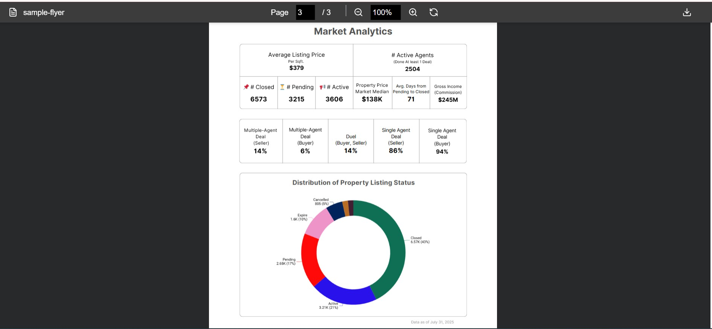
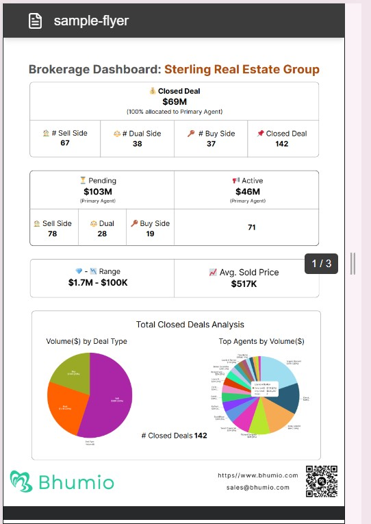

# Next.js PDF Viewer UI

A responsive PDF viewer built with Next.js and React, featuring zoom controls, page navigation, download, and floating page indicators. Buttons like Zoom In, Zoom Out, and Reset are implemented as reusable components to keep code clean and maintainable.


## Features

- **PDF Viewer**: Render PDFs using `react-pdf`.
- **Page Navigation**: Editable page input with scroll-to-page functionality.
- **Zoom Controls**: Zoom in, zoom out, and reset zoom using a reusable `ActionButton` component.
- **Download PDF**: Download the displayed PDF directly.
- **Floating Page Indicator**: Shows current page near the scrollbar on mobile devices.
- **Responsive Design**: Works on both desktop and mobile devices.
- **Dynamic PDF Worker Handling**: Configured to avoid SSR issues in Next.js.  

---

## Demo

- ### PDF View for Desktop
> Smooth scrolling, page number updates, zoom controls, and toolbar visible



- ### PDF View for Desktop
> Responsive design with floating page indicator along the scrollbar.



---

## Installation

1. Clone the repository:
    ```bash
    https://github.com/mangaBhukya/nextjs-pdf-ui.git
    cd nextjs-pdf-ui

2. Install dependencies
    ```bash
    npm install
3. Run the app
    ```bash
    npm run dev


## Open http://localhost:3000 in your browser

